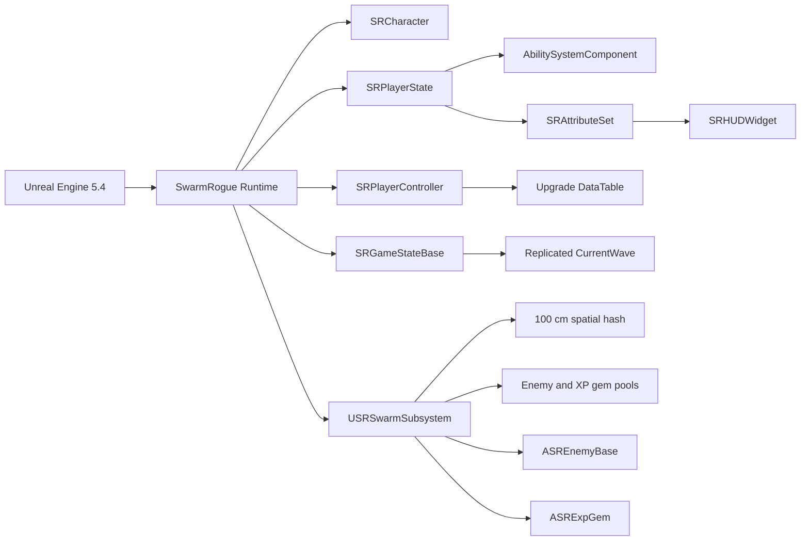
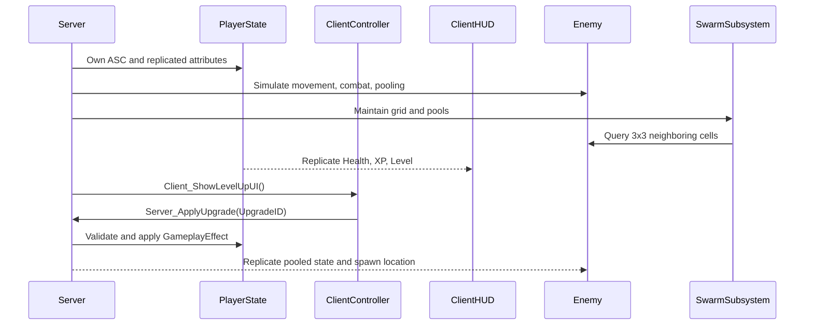

# SwarmRogue Technology Map

This document reflects the current C++ and Unreal configuration in the repository, supplemented by the network and performance study notes in `Docs/references/`.

## Runtime Stack

| Layer | Implementation | Evidence in the codebase | Responsibility |
| --- | --- | --- | --- |
| Engine | Unreal Engine 5.4 | `SwarmRogue.uproject` | Runtime, editor, reflection, replication, and build pipeline |
| Module | `SwarmRogue` | `Source/SwarmRogue/SwarmRogue.Build.cs` | Primary game runtime module |
| Language | C++ / Unreal reflection | `UCLASS`, `UPROPERTY`, `UFUNCTION` | Gameplay systems and Blueprint integration |
| Input | Enhanced Input | `SRCharacter` | Mapping context, movement input, and GAS input binding |
| Abilities | Gameplay Ability System | `SRPlayerState`, `SRAttributeSet`, `SRAssetManager` | Attributes, effects, abilities, and level-up upgrades |
| Gameplay data | Gameplay Tags, DataTable, Data Registry | `DefaultGameplayTags.ini`, `SRPlayerController`, Build.cs | Ability tags, upgrade rows, and data-driven configuration |
| UI | UMG / `USRHUDWidget` | `SRHUDWidget`, `SRPlayerController` | Attribute-driven HUD and level-up UI events |
| Networking | Unreal replication and RPC | `SRGameStateBase`, `SRAttributeSet`, `SRPlayerController`, `SREnemyBase` | Server authority, replicated state, client UI delivery, and upgrade requests |
| Swarm performance | `USRSwarmSubsystem` | `SRSwarmSubsystem` | World-scoped spatial hash and object pools |
| Enemy simulation | `ASREnemyBase` | `SREnemyBase` | Low-frequency navigation, separation, combat, and pooled replication |
| Collectibles | `ASRExpGem` | `SRExpGem` | Magnet/collect behavior, XP Gameplay Effects, and pooling |
| Animation | SPCR Joint Dynamics | `Plugins/SPCRJointDynamics` | Joint and bone dynamics |
| Editor tooling | SwitchLanguage | `Plugins/SwitchLanguage_5.4` | Editor language switching |

## Module and Data Flow

## Network Authority Model

## Swarm Performance Model

The swarm subsystem is a `UWorldSubsystem`, so each `UWorld` owns an isolated instance. Its current implementation uses:

- A 100 cm XY spatial hash. Neighbor searches inspect the surrounding 3x3 cells instead of querying every enemy.
- Weak references in grid buckets and class-specific pools, avoiding stale ownership and allowing garbage collection.
- Enemy and XP gem reuse through `Acquire*` / `Release*`; spawning is reserved for pool warm-up.
- Server-only grid and pool bookkeeping. Clients receive replicated presentation state and do not maintain the authoritative swarm index.
- Low-frequency navigation updates (`0.2 s` default) while Character Movement continues to receive movement input every frame.
- Cached neighbor arrays and cached target searches to reduce repeated allocations and player scans.

## Gameplay Responsibilities

| Class | Responsibility |
| --- | --- |
| `ASRCharacter` | Player movement, camera setup, PlayerState/ASC initialization, and Enhanced Input binding |
| `ASRPlayerState` | Owning the AbilitySystemComponent and `USRAttributeSet` |
| `USRAttributeSet` | Replicated health, movement speed, attack range, XP, and level; applies post-effect behavior |
| `ASRPlayerController` | Server-side upgrade generation, client level-up UI delivery, and validated upgrade requests |
| `ASRGameStateBase` | Replicated wave state and active-player registration |
| `ASRGameModeBase` | Server-only death handling, respawn, and wave progression |
| `ASREnemyBase` | Server-driven navigation, separation, collision damage, health replication, and pooling lifecycle |
| `ASRExpGem` | XP pickup magnetism, Gameplay Effect application, and pooling lifecycle |
| `USRHUDWidget` | Listening to GAS attribute change delegates and updating health UI |
| `USRAssetManager` | Global Asset Manager setup and GAS global data initialization |

## Study References

The reference images are retained as implementation notes rather than product assets:

- [`network-play-as-client.png`](references/network-play-as-client.png): dedicated-server/client test setup and authority boundaries.
- [`rpc-client-server.png`](references/rpc-client-server.png): RPC direction and server-to-client UI communication.
- [`swarm-spatial-hash-pooling.png`](references/swarm-spatial-hash-pooling.png): world subsystem, grid lookup, pooling, and tick-frequency notes.
- [`data-driven-upgrades.png`](references/data-driven-upgrades.png): C++ + DataTable + UI data-driven flow.
- [`data-registry.png`](references/data-registry.png): Data Registry study notes.
- [`vfx-material-notes.png`](references/vfx-material-notes.png): Niagara/material setup notes for the visual layer.
- [`study-log.pptx`](references/study-log.pptx): dated development and networking study log.

These notes describe both implemented systems and planned/learning work. The source files and project configuration are the authority for implementation status.
