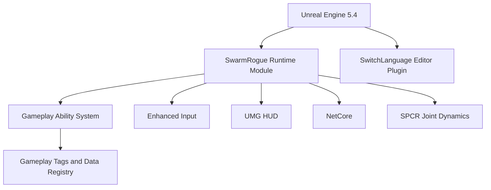

# SwarmRogue

An Unreal Engine 5.4 C++ project for a swarm-based survival game.

[](https://www.unrealengine.com/)
[](https://isocpp.org/)
[](LICENSE)

## Overview

SwarmRogue is a C++ gameplay project built around Unreal Engine's gameplay framework. The codebase contains the runtime module, gameplay state and character systems, swarm-related logic, configuration, and the source for the project plugins.

The repository intentionally excludes Unreal asset files and generated build data. This keeps the source repository small and makes the boundary between code and separately managed game content explicit.

## Technology Stack

| Area | Technology | Role |
| --- | --- | --- |
| Engine | Unreal Engine 5.4 | Runtime, editor, and build pipeline |
| Language | C++ | Gameplay and runtime systems |
| Abilities | Gameplay Ability System | Attributes, abilities, effects, and gameplay tasks |
| Input | Enhanced Input | Input actions and player controls |
| UI | UMG | HUD and runtime widgets |
| Gameplay data | Gameplay Tags, Data Registry | Typed gameplay state and data lookup |
| Networking | NetCore | Networking support used by the runtime module |
| Animation | SPCR Joint Dynamics | Joint and bone dynamics |
| Editor | SwitchLanguage | Editor language switching |
| Toolchain | Visual Studio, Unreal Build Tool | C++ compilation and debugging |

## Architecture



## Repository Layout

```text
Config/                            Project and gameplay configuration
Plugins/                           Plugin source and descriptors
Source/SwarmRogue/                 Runtime C++ module
Source/SwarmRogueEditor.Target.cs  Editor target definition
SwarmRogue.uproject                Unreal project descriptor
```

## Requirements

- Windows 10 or later
- Unreal Engine 5.4
- Visual Studio 2022 with **Game development with C++** installed
- Git

## Getting Started

1. Clone the repository:

   ```bash
   git clone https://github.com/huangnaisheng/SwarmRougle.git
   cd SwarmRogue
   ```

2. Install Unreal Engine 5.4 and the required Visual Studio workload.
3. Right-click `SwarmRogue.uproject` and choose **Generate Visual Studio project files**.
4. Open the generated solution in Visual Studio.
5. Select `Development Editor` and `Win64`, then build the `SwarmRogueEditor` target.
6. Open `SwarmRogue.uproject` in Unreal Editor.

## Content and Generated Files

The following are intentionally excluded from Git:

- `Content/` and Unreal asset files such as `.uasset` and `.umap`
- `Binaries/`, `Intermediate/`, `Saved/`, and `DerivedDataCache/`
- IDE metadata and packaged build output

The project cannot be reproduced as a complete playable build from this repository alone. The matching game content must be provided separately.

## Third-Party Plugins

The repository includes source code for `SPCRJointDynamics` and `SwitchLanguage`. Their upstream terms and licenses remain applicable to those components. See each plugin descriptor and source distribution for details.

## Contributing

Keep generated Unreal files and local assets out of commits. Submit focused changes with a clear commit message and verify that the project still compiles in Unreal Engine 5.4.

## License

This project is licensed under the MIT License. See [LICENSE](LICENSE) for the full text.
