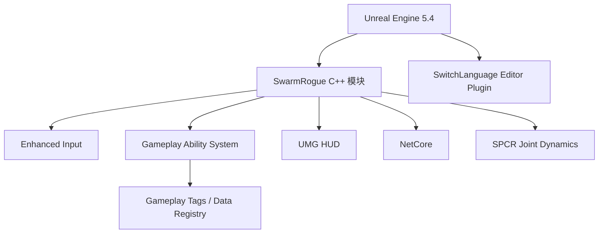

# SwarmRogue

基于 Unreal Engine 5.4 和 C++ 开发的群体生存类游戏项目。

## 技术栈

| 分类 | 技术/模块 | 项目用途 |
| --- | --- | --- |
| 游戏引擎 | Unreal Engine 5.4 | 项目运行时、编辑器和构建流程 |
| 编程语言 | C++ | 核心玩法、角色、敌人和游戏状态逻辑 |
| 输入 | Enhanced Input | 玩家输入映射和控制响应 |
| 角色能力 | Gameplay Ability System | 属性、技能、效果和能力系统 |
| 标签与任务 | Gameplay Tags / Gameplay Tasks | 游戏状态标记和异步任务编排 |
| UI | UMG | HUD 和运行时界面 |
| 数据 | Data Registry | 游戏数据的统一注册与读取 |
| 网络 | NetCore | 网络相关基础支持 |
| 动画插件 | SPCR Joint Dynamics | 关节动力学和骨骼物理效果 |
| 编辑器插件 | SwitchLanguage | Unreal Editor 界面语言切换 |
| 开发工具 | Visual Studio / `.sln` | C++ 编译、调试和项目管理 |

### 技术架构图

## 目录

- `Source/`：游戏 C++ 模块和运行时逻辑
- `Config/`：项目、输入、Gameplay Tags 和编辑器配置
- `Plugins/`：项目使用的插件源码及插件描述文件
- `SwarmRogue.uproject`：Unreal Engine 项目文件

## 开发环境

1. 安装 Unreal Engine 5.4。
2. 克隆仓库并右键 `SwarmRogue.uproject`，选择生成 Visual Studio 项目文件。
3. 使用 Visual Studio 打开生成的解决方案并编译 `Development Editor`。
4. 在 Unreal Editor 中打开项目。

## 资产说明

为保持仓库体积小于 10 MB，项目的 `Content/` 目录、构建产物和编辑器缓存不会提交到 Git。完整运行项目需要另外获取对应的美术资产。

## 许可证

当前仓库未声明开源许可证。
